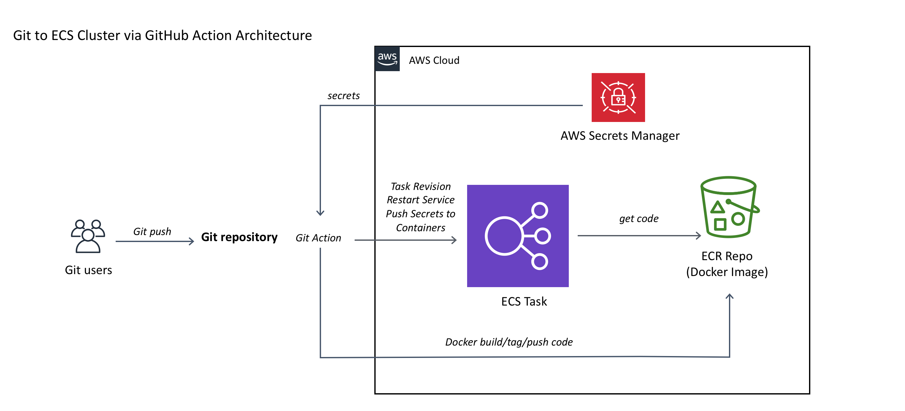

# Secrets Deploy
This action creates a build using your project's Dockerfile, pushes build to ECR, pulls secrets (if available) for your project, restarts the ECS service with a new task definition and pushes your secrets to the running tasks.




## setup

To set this up, create a new IAM user with access to ECR, ECS and Secrets Manager (e.g. with the
AmazonEC2ContainerRegistryFullAccess policy,etc). 

### Build your ECS infrastructure manually or using Cloudformation with the following naming convention:
- ECR: {production | non-production}-{project_name}-repo 
- VPC: productionVPC or non-productionVPC
- Cluster: {production | non-production}-{project_name}-cluster
- Service: {production | non-production}-{project_name}-service
- Task Defintion: {production | non-production}-{project_name}-family:{revison-number}
- Secrets Manager: {production | non-production }/{project-name}  (optional)

### OR Have all this done automatically by:
- git clone https://github.com/turnercode/inthearena-iac/fargate
- cdk deploy --c project-name={project-name} --c environment={production | ..any branch name }


### Then, add the following secrets to your GitHub project:

- `AWS_ACCESS_KEY_ID`
- `AWS_SECRET_ACCESS_KEY`

## inputs
### required
- `AWS_ACCESS_KEY_ID` - Your IAM user's AWS access key ID.
- `AWS_SECRET_ACCESS_KEY` - Your IAM user's AWS secret key.
- `region` - The ECR region to upload to. Defaults to 'us-east-2'.
- `project_name` - The name of this project. 
- `stage` - which branch triggered the build...use ${{ steps.extract_branch.outputs.branch }}

### optional
- `global_region` - (default us-east-1) AWS Region used for services we want to treat as global. Currently Secrets Manager
- `slack_hook_url` - Notifications will be sent to this Slack Hook if provided

## build,deploy,restart service


```yaml
name: Build Docker Image, Deploy to ECR, Start Containers & Read Env vars from Secrets Manager
on: 
    push:
        branches:
            - master
            - staging
            - development
jobs:
  build:
    runs-on: ubuntu-latest
    steps:
    - uses: actions/checkout@v1
    - name: Extract branch name
      run: echo "##[set-output name=branch;]$(echo ${GITHUB_REF#refs/heads/})"
      id: extract_branch
    - uses: gitgregoryjones/secretsdeploy@v6
      with:
        AWS_ACCESS_KEY_ID: ${{ secrets.AWS_ACCESS_KEY_ID }}
        AWS_SECRET_ACCESS_KEY: ${{ secrets.AWS_SECRET_ACCESS_KEY }}
        region: us-east-1
        project_name: inthearena-react
        stage: ${{ steps.extract_branch.outputs.branch }}
```


